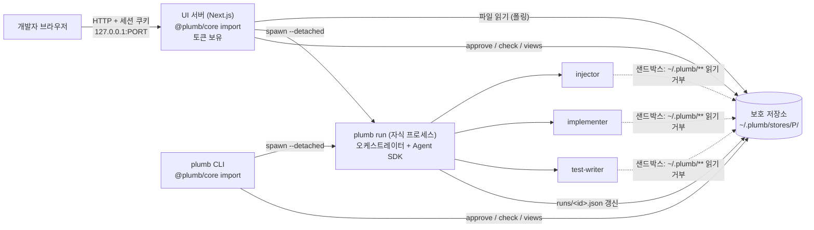

# 화면 구상 — 목록 · 공통 레이아웃 · 프로세스 모델

이슈 #1의 산출물. M0의 와이어프레임(#2~#4)은 이 문서를 전제로 그린다. 이 문서는 설계 결정이므로 네 항목(결정 · 이유 · 기각 · 감수)을 끝에 둔다.

## 1. 화면 목록

작업 화면 3개는 라우트이고, View 6개는 "View 보기" 화면 안의 탭이다. 기획안 §6.4의 나머지 작업 화면(추적성 매트릭스, 검토 대기열, 규칙·계약 편집)은 M10에서 추가한다.

| 라우트 | 화면 | 답하는 질문 | 와이어프레임 |
|---|---|---|---|
| `/views` | View 보기 | 코드 대신 무엇을 읽는가 | #2 `work-views.md` |
| `/views?view=architecture` | 아키텍처 다이어그램 | 무엇이 있고 어떻게 연결되나 | #3 |
| `/views?view=flow` | 도메인별 흐름도 | 주요 시나리오가 어떻게 처리되나 | #4 |
| `/views?view=changelog` | 기술 변경 로그 | 무엇이 왜 바뀌었나 | #4 |
| `/views?view=verification` | 테스트/검증 상태 | 믿어도 되나 | #3 |
| `/views?view=dependencies` | 외부 의존성 | 무엇에 기대고 있나 | #3 |
| `/views?view=contract` | 데이터 모델 / 계약 | 무엇을 어떤 모양으로 저장하고 노출하나 | #3 |
| `/rules` | 규칙 목록 · 승인 | 무엇을 승인할 것인가 | #2 `work-approve.md` |
| `/runs` | 실행 · 진행 상황 | 지금 에이전트가 어디까지 했나 | #2 `work-run.md` |

## 2. 공통 레이아웃

```
┌──────────────────────────────────────────────────────────────────────┐
│ Plumb · testbed      보호 저장소 정상 · 마지막 검사 2분 전 (a1b2c3)   ⚠ 6 │  ← 상단 바
├──────────────┬───────────────────────────────────────────────────────┤
│ 블록 트리      │                                                       │
│  ▸ 시스템(L0)  │   본문 (현재 화면)                                      │
│  ▾ 도메인(L1)  │                                                       │
│    payment ●  │                                                       │
│    auth    ○  │                                                       │
│  미분류 12 ▲   │                                                       │
├──────────────┴───────────────────────────────────────────────────────┤
│ /views · /rules · /runs                                               │  ← 하단 또는 좌측 내비
└──────────────────────────────────────────────────────────────────────┘
```

상단 바와 블록 트리는 모든 화면에 고정이다. 항목과 출처:

| 항목 | 출처 |
|---|---|
| 프로젝트 이름 | 저장소: `plumb.config.json` 의 대상 경로 이름 |
| 보호 저장소 상태 (정상 / 변조 증거) | 실행: `plumb check` 의 해시 체인 검증 결과 (M3는 "정상" 고정, 해시 체인은 M10) |
| 마지막 검사 커밋 · 시각 | 저장소: 마지막 `plumb check` 결과 기록 |
| 미확인 항목 수 `⚠ n` | 저장소: 상태가 잠정(`⚠ 미확인`)인 규칙 수 + 검토 대기열 항목 수 |
| 블록 트리 L0 / L1 | 파서: 어댑터 `extractDependencies()` → 블록 그래프 JSON. 글롭 재정의는 `plumb.config.json` |
| 블록 옆 상태 점 | 저장소: 그 블록 규칙들의 최악 상태 (🔴 > 🟠 > 🟡 > 🟢 > ⬜) |
| 미분류 파일 수 | 파서: 블록 그래프에서 어느 블록에도 속하지 않는 파일 수 (기획안 §12, 항상 보인다) |

블록을 클릭하면 현재 화면이 그 블록으로 필터링된다. 블록 트리는 M1 #9에서 빈 뼈대, M8에서 실제 데이터.

### 2.1 출처 표기 규칙 (#2~#4 공통)

와이어프레임의 모든 항목은 출처를 아래 다섯 접두어 중 하나로 적는다. 어느 것도 아니면 그 항목은 화면에 넣지 않는다 (기획안 §6 "LLM이 그린 View는 안 된다").

| 접두어 | 뜻 | 예 |
|---|---|---|
| `파서:` | 코드·설정·스키마를 정적으로 읽은 결과 | dependency-cruiser, Prisma 스키마, OpenAPI, lockfile |
| `실행:` | 테스트·검사를 실제로 돌린 결과 | JUnit XML, 위반 주입 결과, OTel 트레이스 |
| `저장소:` | 보호 저장소에 기록된 것 | 규칙, 승인 기록, 결정 기록, 검사 결과 이력 |
| `git:` | git 이력에서 읽은 것 | diff, 커밋, 변경 파일 |
| `사용자 입력:` | 화면에서 개발자가 직접 넣는 것 | 승인 버튼, 코드 열람 이유 |

### 2.2 코드 열람 점프

View의 항목에서 `file:line`을 누르면 IDE가 열린다. 도구는 코드를 보여주지 않는다 (기획안 §3, §16).

- 링크: `plumb open <file>:<line> --reason <View 오류|정보 부족|디버깅·환경>` 을 UI 서버가 호출. IDE 명령은 설정(`ide: "code --goto {file}:{line}"`)
- 기록: `저장소: code-opens.jsonl` 에 시각 · 어느 View · 어느 항목 · 이유 한 줄. 기획안 §15.3 명제 검증의 원자료
- 누르기 전에 이유 종류를 고르게 한다. 고르지 않으면 열리지 않는다

## 3. 프로세스 모델

### 3.1 결정: UI 서버가 코어를 import하고, 파이프라인은 분리된 자식 프로세스로 돈다



세 종류의 프로세스가 있다.

| 프로세스 | 수명 | 하는 일 | 코어 접근 |
|---|---|---|---|
| `plumb` CLI | 명령 하나 | `approve`, `check`, `views`, `run` 시작, CI 병합 게이트, git hook | `@plumb/core` 직접 import |
| UI 서버 | 개발자가 켜 둔 동안 | 화면 제공, 승인 API, `run` 시작, 진행 상황·View 파일 읽기 | `@plumb/core` 직접 import (route handler 안에서) |
| `plumb run` | 파이프라인 한 번 | 오케스트레이터. 역할 에이전트를 Agent SDK로 띄움. `setsid`/`detached: true` 로 부모와 분리 | `@plumb/core` 직접 import |

- UI 서버와 CLI는 **같은 코어의 두 입구**다 (기획안 §4.3). 코어는 저장소 읽기·쓰기, 검사 실행, View 생성을 함수로 제공하고, 두 입구는 그것을 부른다. 코어에는 HTTP 서버가 없다
- **UI 서버를 재시작해도 `plumb run`은 죽지 않는다.** 자식은 분리된 프로세스 그룹이고, 상태는 `runs/<id>.json` 파일에 있다. UI는 그 파일을 폴링해서 그린다 (첫 슬라이스는 1~2초 폴링. SSE는 필요해지면)
- 데스크톱 포장(M10)은 Electron/Tauri가 UI 서버를 띄우는 것이지, 모델이 바뀌는 것은 아니다
- 보호 저장소는 레포 밖 `~/.plumb/stores/<project>/`. 역할 에이전트의 OS 샌드박스는 `~/.plumb/**` 읽기·쓰기를 거부한다 (기획안 §8.6, §10)

### 3.2 승인 통로와 토큰

기획안 §4.3: "화면 서버는 시작할 때 일회용 토큰을 만들어 브라우저에만 넘기고(Jupyter 방식), 토큰 파일은 에이전트가 읽을 수 없는 곳에 둔다."

```
plumb ui
  1. 토큰 T = 32바이트 난수 생성
  2. ~/.plumb/run/<project>/ui.json 에 { port, token: T, pid } 저장, 권한 0600
     (에이전트 샌드박스는 ~/.plumb/** 를 못 읽는다)
  3. 127.0.0.1:PORT 에 바인드 (0.0.0.0 금지)
  4. 브라우저를 http://127.0.0.1:PORT/auth?token=T 로 연다
  5. /auth 는 T가 맞으면 httpOnly · SameSite=Strict 쿠키를 심고 /views 로 보낸다. T는 URL에서 사라진다
  6. 이후 모든 /api/** 는 쿠키를 검사한다. 없거나 틀리면 401. 토큰 재발급은 서버 재시작뿐
```

- `plumb approve`(CLI)는 토큰을 쓰지 않는다. 개발자가 자기 셸에서 직접 부르는 것이고, 코어가 저장소에 직접 쓴다. 에이전트가 CLI를 못 쓰는 것은 샌드박스(`~/.plumb/**` 거부)가 맡는다
- 에이전트가 셸로 `curl 127.0.0.1:PORT/api/rules/x/approve` 를 호출해도 쿠키가 없어 401. 이것이 기획안 §15.1 통과 기준 "에이전트는 승인할 수 없다"의 시험 항목이다 (M3 종료 증거)
- 읽기 API도 같은 쿠키를 요구한다. 규칙을 하나로 두는 편이 검사하기 쉽다

### 3.3 API 표면 초안 (UI 서버 route handler)

이름만 정한다. 요청·응답 타입은 #5에서.

| 메서드 | 경로 | 하는 일 | 코어 함수 | 도입 |
|---|---|---|---|---|
| GET | `/api/status` | 상단 바 (저장소 상태, 마지막 검사, 미확인 수) | `store.status()` | M3 |
| GET | `/api/blocks` | 블록 트리 | `adapter.extractDependencies()` 캐시 | M8 |
| GET | `/api/rules` | 규칙 목록 + 상태 | `store.rules.list()` | M3 |
| GET | `/api/rules/:id` | 규칙 하나 + 승인 이력 + 결정 기록 | `store.rules.get()` | M3 |
| POST | `/api/rules/:id/approve` | 승인 (고위험 완화는 사전 승인) | `store.rules.approve()` | M3 |
| POST | `/api/rules/:id/reject` | 기각 + 사유 | `store.rules.reject()` | M3 |
| POST | `/api/runs` | 파이프라인 시작 (규칙 ID 목록) | `spawn('plumb run --detach ...')` | M6 |
| GET | `/api/runs` | 실행 목록 | `runs/*.json` 읽기 | M6 |
| GET | `/api/runs/:id` | 진행 상황 (단계 ①~⑥, 역할, 종료 차단 횟수, 예산) | `runs/<id>.json` 읽기 | M6 |
| GET | `/api/views/:name` | View 하나 (Markdown + Mermaid) | `views.render(name)` 또는 `views/<name>.md` 읽기 | M8 |
| POST | `/api/open` | 코드 열람 점프 + 이유 기록 | `ide.open()` + `store.codeOpens.append()` | M8 |

### 3.4 결정 기록

**결정.** 코어는 라이브러리다. UI 서버(Next.js)와 CLI가 각각 코어를 import하는 두 입구이고, 파이프라인은 `plumb run`을 분리된 자식 프로세스로 띄워 돌린다. 상주 데몬은 두지 않는다. 승인 통로는 UI 서버가 시작 시 만든 토큰 → 브라우저 쿠키로만 열린다.

**이유.**
- 기획안 §4.3 표의 "화면: 코어를 import해서 사용"과 토큰 문구를 그대로 구현한 것이다
- "화면 서버를 재시작해도 에이전트가 죽으면 안 된다"는 요구는 자식 프로세스 분리로 충분히 만족된다. 상태가 파일(`runs/<id>.json`)에 있으므로 어느 프로세스가 읽어도 같다
- 1인용 로컬 도구라 동시 접근 제어가 필요 없다. 데몬이 해결하는 문제(여러 클라이언트, 공유 메모리 상태)가 아직 없다

**기각한 대안.**
- 상주 코어 데몬 + HTTP API (이슈 #1 초안의 기본안) — 데몬 생명주기(시작·발견·종료·좀비) 관리와 API 계약이 하나 더 생긴다. 첫 슬라이스에서 얻는 것이 없다. 다중 프로젝트·다중 창이 필요해지는 M10 데스크톱 포장에서 재검토한다
- Electron IPC로 코어 직결 — CLI와 CI가 같은 코어를 못 쓰고, 앱을 닫으면 파이프라인이 죽는다. 기획안 §4.3 위반
- 브라우저가 보호 저장소 파일을 직접 읽기(파일 서버) — 승인 쓰기 경로가 파일 권한에만 의존하고, 토큰 통로가 없어진다
- WebSocket/SSE로 진행 상황 푸시 — 첫 슬라이스에서는 폴링으로 충분. 지연이 문제 되면 SSE 추가

**감수하는 것.**
- `plumb run`이 분리된 뒤 UI 서버가 그 프로세스를 직접 제어하지 못한다. 중단은 `runs/<id>.json`의 pid로 시그널을 보내는 방식이 되고, 좀비 정리는 `plumb run` 자신의 책임이다
- UI 서버가 코어를 import하므로 UI 서버 프로세스가 보호 저장소에 쓸 권한을 가진다. UI 서버는 에이전트 샌드박스 밖에서 개발자 권한으로 돌아야 하고, 이것은 설정이 아니라 실행 방식의 규율이다
- 데몬이 없으므로 UI 서버가 꺼져 있으면 승인 화면도 없다. CLI `plumb approve`가 대체 경로다

**영향.** #2 (실행 화면은 `runs/<id>.json`의 필드를 그린다), #3·#4 (출처 접두어 규칙), #5 (API 요청·응답 타입, `RunState` 타입), M3 #17 (토큰 흐름 그대로 구현), M6 (detached spawn).
