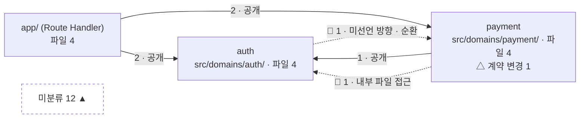
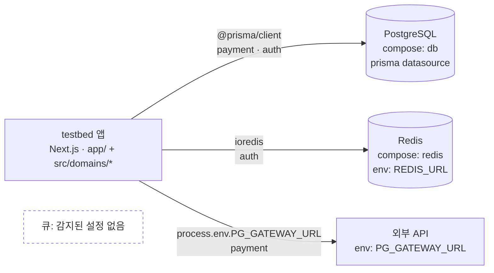

# View — 아키텍처 다이어그램 (`/views?view=architecture`)

이슈 #3의 산출물. `docs/screens/README.md`의 공통 레이아웃(상단 바 · 블록 트리), 출처 표기 규칙 2.1, 코드 열람 점프 2.2를 전제로 한다. 와이어프레임 안의 값은 "이 파서가 이 입력에서 이렇게 뽑는다"를 보이는 예시이고, 화면은 파서 결과가 있을 때만 그려진다(5절). 목 데이터로 채우지 않는다.

출처 접두어 사용 기준(#3 네 View 공통):

- `파서:` — 코드·설정·스키마를 정적으로 읽은 것. `plumb.config.json`도 레포 안의 설정 파일이므로 `파서:`다 (README 2 표의 "저장소: `plumb.config.json`"은 2.1 정의와 어긋난다. PR 본문에 적는다)
- `실행:` — 검사·테스트를 실제로 돌려 나온 값. 마지막 `plumb check` 결과를 저장소 파일에서 읽어 그리더라도 값의 출처는 `실행:`이다
- `저장소:` — 사람이 승인·결정·기록으로 보호 저장소에 쓴 것
- `git:` — git 이력에서 읽은 것

### 가정하는 testbed (M2, 기획안 §4.4)

```
examples/testbed/
  app/api/{payments,refunds,login,logout}/route.ts   얇은 Route Handler. 도메인 공개 진입점만 import
  src/domains/payment/{index.ts, create-payment.ts, refund.ts, repo.ts}
  src/domains/auth/{index.ts, session.ts, session-store.ts, refresh.ts}
  src/export/report.ts, src/export/csv.ts, src/lib/money.ts, …     어느 블록에도 속하지 않음
  prisma/schema.prisma · openapi.yaml · docker-compose.yml · .env.example
  pnpm-lock.yaml · plumb.config.json · .dependency-cruiser.cjs
  test/acceptance/*.spec.ts
```

## 1. 답하는 질문

"무엇이 있고 어떻게 연결되나" (README 1 표). 구체적으로:

- **L0 시스템**: 앱 하나가 어떤 인프라(DB · 큐 · 외부 API)에 기대고 있나. 큐가 없으면 "없음"이 보여야 한다
- **L1 도메인**: 블록이 몇 개이고, 누가 누구를 import하나. 그 방향은 선언된 것인가, 공개 진입점을 통하나, 순환은 없나
- **경계 밖**: 어느 블록에도 속하지 않는 파일이 몇 개인가 (기획안 §12 "미분류 파일은 항상 크기를 보여준다")
- **필수 검사 3개의 결과** (기획안 §12): (1) 공개 계약으로만 접근 (2) 선언된 방향만 · 순환 금지 (3) 공개 계약 시그니처 변경은 설계 변경 이벤트

L2(유닛)·L3(심볼)은 이 View에 없다. L2는 계약 View(`view-data-contract.md`)의 엔드포인트·모델이 맡는다.

## 2. 와이어프레임

### 2.1 L1 도메인 수준 (기본)

```
┌ View 보기 ─ [아키텍처] 흐름도 · 변경 로그 · 검증 · 의존성 · 계약 ─────────────────────────────┐
│ 수준: ( L0 시스템 ) [ L1 도메인 ]     필터: 전체 ▾     생성: a1b2c3 · 2분 전 · dependency-cruiser │
├──────────────────────────────────────────────────────────────────────────────────────────┤
│ 블록 3 · 경계 넘는 import 6 · 위반 2 (접근 1 · 방향 1) · 순환 1 · 미분류 12 ▲ · 계약 변경 1       │
├────────────────────────────────────────────┬─────────────────────────────────────────────┤
│                                            │ 선택: payment → auth                          │
│   (아래 Mermaid 그래프)                      │  선언: 허용 (plumb.config.json blocks.payment)  │
│                                            │  import 2                                      │
│                                            │  🟢 src/domains/payment/refund.ts:3            │
│                                            │     from '@/domains/auth'  (공개 진입점)         │
│                                            │  🔴 src/domains/payment/refund.ts:4  [IDE에서 열기] │
│                                            │     from '@/domains/auth/session-store'        │
│                                            │     필수 검사 (1) 위반: 공개 진입점이 아님         │
├────────────────────────────────────────────┴─────────────────────────────────────────────┤
│ 필수 검사 (실행: plumb check · a1b2c3 · 2분 전)                                             │
│  (1) 공개 계약으로만 접근       🔴 1  payment → auth/session-store.ts                        │
│  (2) 선언된 방향만 · 순환 금지   🔴 1  auth → payment 미선언 (src/domains/auth/refresh.ts:2)   │
│                                        순환 1: auth ⇄ payment                               │
│  (3) 공개 계약 시그니처 변경     △ 1  payment/index.ts `refund()` 매개변수 추가 (git a1b2c3)    │
│                                        → 설계 변경 이벤트 · 변경 로그 View에서 사유 확인          │
├──────────────────────────────────────────────────────────────────────────────────────────┤
│ 미분류 12 ▲  src/lib/money.ts · src/export/report.ts · src/export/csv.ts · … 외 9  [펼치기]  │
│ 마지막 커밋(a1b2c3) 영향 범위: 2 블록 (payment, app) + 미분류 1                               │
└──────────────────────────────────────────────────────────────────────────────────────────┘
```

출처: `파서: dependency-cruiser JSON → 블록 그래프 JSON` (노드 · 간선 · 미분류) · `파서: plumb.config.json` (선언된 방향) · `실행: plumb check` (필수 검사 (1)(2)) · `git: 공개 진입점 diff` (필수 검사 (3), 영향 범위). 항목별 상세는 3절.

본문 그래프 (파서: dependency-cruiser JSON → 블록 그래프 JSON → Mermaid):



간선 라벨의 숫자는 그 방향으로 경계를 넘는 import 문 수다. 실선은 선언된 방향이고 공개 진입점(`index.ts`)만 거친다. 점선 🔴는 필수 검사 (1) 또는 (2)의 위반이다. 미분류 노드는 간선을 그리지 않고 크기만 보인다 — 미분류 파일이 블록을 import하는 것은 블록 경계 밖의 일이고, 그 수는 "검사 범위 밖"(검증 View)에서 다시 센다.

### 2.2 L0 시스템 수준

```
┌ 수준: [ L0 시스템 ] ( L1 도메인 )     생성: a1b2c3 · 2분 전 · 설정·인프라 파일 3개 읽음 ──────────┐
│ 노드 4 (앱 1 · DB 1 · 캐시 1 · 외부 API 1) · 큐: 감지된 설정 없음                                │
├──────────────────────────────────────────────────────────────────────────────────────────┤
│   (아래 Mermaid 그래프)                                                                     │
├──────────────────────────────────────────────────────────────────────────────────────────┤
│ 선택: PostgreSQL                                                                           │
│   근거  docker-compose.yml:3 services.db image: postgres:16        [IDE에서 열기]            │
│         prisma/schema.prisma:2 datasource db { provider = "postgresql" url = env("DATABASE_URL") } │
│         .env.example:1 DATABASE_URL                                                        │
│   쓰는 블록  payment (repo.ts:1 @prisma/client) · auth (session.ts:1 @prisma/client)          │
└──────────────────────────────────────────────────────────────────────────────────────────┘
```



출처: `파서: 설정·인프라 파일` (docker-compose services · prisma datasource · `.env.example` 변수 이름 → 노드와 근거 `file:line`) · `파서: import 분석` (클라이언트 패키지를 import하는 블록 → 간선 라벨 둘째 줄).

L0 간선은 "앱 → 인프라" 한 방향뿐이다. 코드가 있는 쪽은 앱 하나이므로 방향 검사는 L0에 없다. 간선 라벨 두 줄 중 첫 줄은 근거(클라이언트 패키지 또는 환경변수 이름), 둘째 줄은 그 근거를 import·참조하는 L1 블록이다.

## 3. 항목 표

| 항목 | 출처 | 생성 방식 (어느 파서의 어느 필드) | 도입 마일스톤 | 비고 |
|---|---|---|---|---|
| L1 블록 노드 (이름 · 경로 · 파일 수) | 파서: dependency-cruiser JSON → 블록 그래프 JSON | `modules[].source`를 블록 경계에 매핑. 경계 기본값 `src/domains/<이름>/` + `app/`, 재정의는 `plumb.config.json` `blocks[].include` 글롭 | M8 wave 0 | 어댑터 `extractDependencies()`의 결과. 블록 트리(README 2)와 같은 JSON |
| L1 간선 (방향 · import 수) | 파서: dependency-cruiser JSON → 블록 그래프 JSON | `modules[].dependencies[].resolved`의 블록 ≠ 출발 블록인 것을 (from, to)로 묶어 센다 | M8 wave 0 | 라벨 숫자 = import 문 수. 모듈 수가 아니다 |
| 간선의 "공개 / 내부 파일" 구분 | 파서: dependency-cruiser JSON → 블록 그래프 JSON | `dependencies[].resolved`가 대상 블록의 공개 진입점(`index.ts`, 재정의 `blocks[].public`)인지 | M8 wave 0 | 필수 검사 (1)의 원자료 |
| 간선의 "선언 / 미선언" 구분 | 파서: `plumb.config.json` `blocks[].dependsOn` | 간선 (from, to)가 `dependsOn`에 있으면 선언. 없으면 미선언 | M8 wave 0 | 선언을 저장소 규칙으로 옮길지는 6절 |
| 순환 수 | 파서: dependency-cruiser JSON | `summary.violations[]` 중 `rule.name == "no-circular"` 를 블록 수준으로 접은 것 | M8 wave 0 | 블록 안의 파일 순환은 세지 않는다 (L2 이하) |
| 필수 검사 (1)(2) 결과 🔴 n건 + `file:line` | 실행: plumb check (dependency-cruiser 규칙 위반 → 1등급 검사 결과) | `.dependency-cruiser.cjs`에 블록 경계 규칙을 생성해 돌린 `violations[].from` · `.to` · `rule.name`. 줄 번호는 `from` 모듈의 해당 import 문 위치 | M5 wave 0 · 화면은 M8 | 기획안 §7.2 1등급(증명). 상태는 🔴 또는 🟢 두 가지뿐 — 정적 분석에는 🟡·🟠가 없다 |
| 필수 검사 (3) 공개 계약 시그니처 변경 △ n건 | git: 공개 진입점 파일 diff (마지막 검사 커밋 → HEAD) | 각 블록 `public` 파일의 export 선언(`tsc --declaration` 출력)을 커밋 간 비교. 차이가 있으면 1건 | M8 wave 1 | 이벤트 자체와 사유는 변경 로그 View(#4). 여기서는 건수와 링크만 |
| 요약 띠 (블록 수 · 경계 넘는 import 수 · 위반 수 · 순환 수) | 파서: 블록 그래프 JSON + 실행: plumb check | 위 항목들의 합 | M8 wave 0 | |
| 미분류 파일 수 ▲ + 목록 | 파서: 블록 그래프 JSON | `modules[].source` 중 어느 블록 글롭에도 안 맞는 것. `node_modules`·테스트·설정 파일은 `plumb.config.json` `ignore`로 제외 | M8 wave 0 | 항상 표시. 0이어도 "미분류 0"을 쓴다 |
| 마지막 커밋 영향 범위 (n 블록 + 미분류 m) | git: HEAD 커밋 변경 파일 목록 | `git diff --name-only HEAD~1` 의 각 파일을 블록 그래프의 블록 경계에 매핑해 블록 수를 센다 | M8 wave 0 | 기획안 §12 측정 "변경 하나가 몇 블록에 걸쳤는가". 커밋 하나 기준. 범위(여러 커밋)는 6절 |
| 생성 커밋 · 시각 · 도구 버전 | 파서: 블록 그래프 JSON 헤더 | `generatedAt`, `commit`, `tool: {name, version}` | M8 wave 0 | 결과가 어느 코드 상태의 것인지 항상 보인다 (기획안 §7.3) |
| L0 노드 — 앱 | 파서: `plumb.config.json` 대상 경로 + `package.json` `name` | 대상 하나 = 노드 하나 | M8 wave 0 | 모노레포 다중 앱은 M10 |
| L0 노드 — DB | 파서: 설정·인프라 파일 (`prisma/schema.prisma` datasource + `docker-compose.yml` services) | Prisma DMMF `datasources[].provider`, `url.fromEnvVar`; compose `services.<이름>.image` 가 `postgres*` 등 알려진 DB 이미지 | M8 wave 0 | 두 근거가 모두 있으면 하나로 합친다 (`DATABASE_URL` 이름으로) |
| L0 노드 — 캐시 · 큐 · 외부 API | 파서: 설정·인프라 파일 (`docker-compose.yml` services + `.env.example` 변수 이름) | compose `services.*.image` 중 `redis*`·`rabbitmq*`·`kafka*` 등; `.env.example`의 `*_URL`·`*_API_KEY` 이름. 환경변수 **값**은 읽지 않는다 | M8 wave 0 | 큐가 없으면 "큐: 감지된 설정 없음" 노드. 추정으로 노드를 만들지 않는다 |
| L0 간선 (앱 → 인프라) + 쓰는 L1 블록 | 파서: import 분석 (dependency-cruiser `dependencyTypes: npm` 모듈) + 환경변수 이름 참조 스캔 | 클라이언트 패키지(`@prisma/client`, `ioredis`, …) import 또는 `process.env.<이름>` 참조가 있는 파일의 블록 | M8 wave 0 (패키지) · M8 wave 0 이후 (env 스캔은 어댑터에 추가) | 패키지 → 서비스 매핑표는 어댑터 내장. 의존성 View와 같은 표를 쓴다 |
| L0 선택 패널의 근거 `file:line` | 파서: 설정·인프라 파일 | 위 노드를 만든 파일과 줄 (YAML·Prisma 파서의 위치 정보) | M8 wave 0 | 2.2 코드 열람 점프 대상 |
| 블록 필터 (블록 트리 클릭) | 사용자 입력: 블록 트리 선택 | 선택 블록 + 그 블록과 간선이 있는 블록만 남긴다 | M8 wave 2 | README 2 "블록을 클릭하면 현재 화면이 그 블록으로 필터링" |
| [IDE에서 열기] | 사용자 입력: 이유 선택 → `plumb open <file>:<line> --reason …` | README 2.2 | M8 wave 2 | 기록은 `저장소: code-opens.jsonl` |

## 4. 동작

- **수준 전환** `L0 시스템 / L1 도메인`: 상단 토글. 블록 트리에서 "시스템(L0)"을 누르면 L0, 도메인이나 그 자식을 누르면 L1로 바뀐다. URL은 `/views?view=architecture&level=L1`
- **블록 필터**: 블록 트리에서 `payment`를 누르면 L1 그래프가 `payment` + 이웃(`app`, `auth`)만 남고, 요약 띠·필수 검사·미분류는 **필터와 무관하게 전체 값**을 유지한다 (미분류와 위반 수를 필터로 숨기지 않는다)
- **간선 클릭**: 오른쪽 패널에 그 방향의 import 문 전체를 `file:line`으로 나열. 공개 진입점은 🟢, 내부 파일 접근은 🔴
- **노드 클릭**: 그 블록의 파일 목록 + 들어오는/나가는 간선 요약. L0 노드는 근거 파일(`docker-compose.yml:3` 등)
- **`file:line` 점프 위치**: 간선 패널의 import 행 · 필수 검사 (1)(2)의 위반 행 · L0 근거 행 · 미분류 목록의 각 파일. 모두 README 2.2 (이유 선택 → `plumb open`). 필수 검사 (3)은 변경 로그 View로 가는 링크이고 IDE를 열지 않는다
- **미분류 ▲ 펼치기**: 파일 전체 목록. 각 행에 "어느 블록 글롭에도 안 맞음"만 적는다. 어디에 속해야 하는지 추천하지 않는다 (추천은 LLM 판정이고, View에 넣지 않는다)
- **새로고침**: `plumb views`가 다시 돈 뒤 블록 그래프 JSON의 `generatedAt`이 바뀌면 다시 그린다. 화면에서 생성을 트리거하는 버튼은 M8 wave 2 (`POST /api/views/:name/refresh`는 README 3.3에 없으므로 #5에서 추가 여부 결정)

## 5. 비어 있을 때

| 상황 | 화면 |
|---|---|
| 블록 그래프 JSON 없음 (`plumb views`를 한 번도 안 돌림) | 본문 전체를 "의존성 추출 결과 없음 — `plumb views` 를 실행하세요" 한 줄로. 그래프·요약 띠를 그리지 않는다 |
| dependency-cruiser 실행 실패 | "추출 실패 (exit 2) · stderr 마지막 20줄" + 이전 성공 결과가 있으면 그 결과를 **생성 커밋·시각을 크게 표시한 채** 그린다. 없으면 위와 같다 |
| `plumb.config.json` 없음 | 블록 경계는 기본값(`src/domains/*`, `app/`)만. 선언된 방향이 없으므로 모든 간선이 "미선언"으로 표시된다 — 숨기지 않는다. 상단에 "plumb.config.json 없음: 방향 선언 없음" |
| 블록 0개 (디렉토리 규약을 안 따르는 프로젝트) | L1에 노드 없음, 미분류 n = 전체 파일 수. "블록 0 · 미분류 n ▲" 요약 띠만. L0는 평소대로 |
| 설정·인프라 파일 없음 (compose · prisma · .env.example 전부 없음) | L0에 앱 노드 하나와 "감지된 인프라 없음". 추정 노드를 만들지 않는다 |
| `plumb check`가 한 번도 안 돎 | 필수 검사 영역에 "검사 없음 ⬜" — 위반 0건이라고 쓰지 않는다. 그래프의 간선 색은 파서 결과(공개/내부, 선언/미선언)만으로 칠한다 |
| git 없음 (아카이브 등) | 필수 검사 (3)과 "마지막 커밋 영향 범위"는 "git 이력 없음" |

## 6. 열린 질문 (#5 타입 설계로 넘김)

1. **블록 그래프 JSON 형태.** 초안: `{ generatedAt, commit, tool, blocks: [{ id, level: "L0"|"L1", kind: "app"|"domain"|"db"|"cache"|"queue"|"external-api", paths: string[], public: string[], files: number }], edges: [{ from, to, count, declared: boolean, imports: [{ file, line, specifier, viaPublic: boolean }] }], unclassified: string[], evidence: [{ node, file, line, excerpt }] }`. L0와 L1을 한 파일에 둘지 둘로 나눌지
2. **선언된 방향의 위치.** `plumb.config.json` `blocks[].dependsOn`(파서)인가, 보호 저장소의 규칙(저장소, 승인 필요)인가. 기획안 §12는 "선언된 것만"이라고 하고, 선언을 바꾸는 것이 설계 변경이라면 승인 통로를 거쳐야 한다. M3 저장소 레이아웃과 함께 결정
3. **필수 검사 (3)의 "시그니처" 정의.** `tsc --declaration` 출력의 텍스트 diff인가, export 이름·타입의 구조 비교인가. #4 변경 로그와 공유하는 타입
4. **환경변수 이름 참조 스캔**(`process.env.X`)을 어댑터 `extractDependencies()`에 넣을지 별도 함수로 둘지. 없으면 L0 외부 API 간선의 "쓰는 블록"이 비고 노드만 남는다
5. **변경 영향 범위의 기간.** HEAD 커밋 하나인가, 마지막 검사 커밋 이후 전체인가. 기획안 §12 측정의 단위를 정해야 추세 표시(M10)가 가능
6. **`app/` 블록의 지위.** 도메인이 아니지만 L1에 그려야 "app은 공개 진입점만 import"(§4.4)를 검사 (1)로 볼 수 있다. `kind: "entry"`로 둘지
