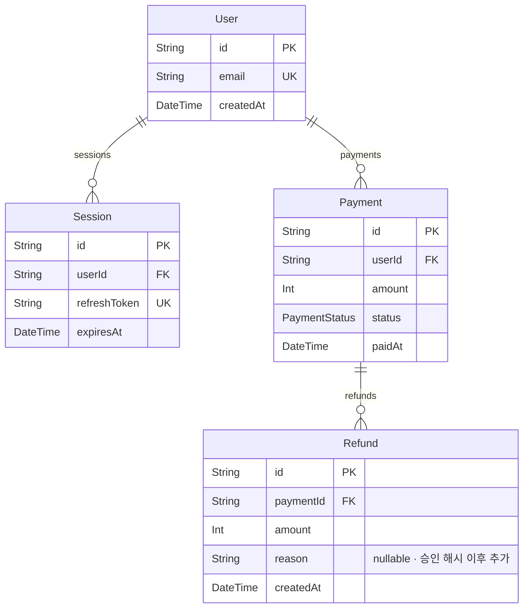

# View — 데이터 모델 / 계약 (`/views?view=contract`)

이슈 #3의 산출물. `docs/screens/README.md`의 공통 레이아웃, 출처 표기 규칙 2.1, 코드 열람 점프 2.2를 전제로 한다. 출처 접두어 사용 기준과 가정하는 testbed는 `view-architecture.md` 머리에 있다. 와이어프레임 안의 값은 파서가 그 입력에서 뽑는 모양의 예시다.

계약은 표준 포맷으로 레포 안에 둔다 (기획안 §5.1): DB 스키마 `prisma/schema.prisma`, API `openapi.yaml`, 이벤트 `asyncapi.yaml`(있으면). 승인된 계약의 해시는 보호 저장소에 기록된다. 이 View는 그 세 파일을 파서로 읽은 결과와, 해시 기록·git diff를 나란히 보인다.

## 1. 답하는 질문

"무엇을 어떤 모양으로 저장하고 노출하나" (README 1 표). 구체적으로:

- **저장**: 모델이 몇 개이고 필드와 관계는 무엇인가 (Prisma)
- **노출**: 엔드포인트가 몇 개이고 요청·응답은 어떤 스키마인가. 어느 블록이 담당하나 (OpenAPI)
- **이벤트**: 발행·구독하는 이벤트 스키마가 있나 (AsyncAPI. 없으면 "없음")
- **변경**: 승인된 계약(해시)과 지금 파일이 같은가. 다르면 무엇이 바뀌었나 (git diff)
- **불일치**: 계약과 코드가 일치하나. 기획안 §5.4 — 계약 변경 승인 직후 코드와 불일치 🔴가 생기는 것이 **정상 상태**이고, 파이프라인이 돌아 🟢가 된다

이 View의 항목은 블록 모델의 L2(유닛: `POST /login`, `User` 엔티티)에 해당한다 (기획안 §12).

## 2. 와이어프레임

```
┌ View 보기 ─ 아키텍처 · 흐름도 · 변경 로그 · 검증 · 의존성 · [계약] ───────────────────────────────┐
│ 필터: 전체 ▾        생성: a1b2c3 · 2분 전 · prisma 5.x · openapi 3.1 · asyncapi 없음               │
├────────────────────────────────────────────────────────────────────────────────────────────┤
│ 계약 상태                                                                                    │
│  openapi.yaml          승인 h=9f3e…  현재 h=9f3e…  일치 🟢   코드 일치 🟢 (계약 테스트 4/4 · a1b2c3) │
│  prisma/schema.prisma  승인 h=71c0…  현재 h=b2d4…  변경 🔴   코드 불일치 🔴 (계약 테스트 1/3 실패)   │
│                        ↳ 승인 D-0007 "Refund.reason 추가" (2시간 전) → 파이프라인 대기. 정상 (§5.4)   │
│  asyncapi.yaml         파일 없음 — 이벤트 계약 없음                                              │
├────────────────────────────────────────────────────────────────────────────────────────────┤
│ ▾ DB 스키마 (파서: Prisma)  모델 4 · enum 1 · 관계 3                                            │
│                                                                                              │
│   (아래 Mermaid erDiagram)                                                                   │
│                                                                                              │
│   Refund   prisma/schema.prisma:31   [IDE에서 열기]                                             │
│     id         String   @id @default(uuid())                                                  │
│     paymentId  String   → Payment (N:1, onDelete: Restrict)                                   │
│     amount     Int                                                                            │
│     reason     String?  △ 승인 해시 이후 추가 (git +1)                                           │
│     createdAt  DateTime @default(now())                                                       │
├────────────────────────────────────────────────────────────────────────────────────────────┤
│ ▾ 엔드포인트 (파서: OpenAPI)  4 · 블록: payment 2 · auth 2                                      │
│   메서드  경로         요청                 응답                  블록      핸들러                │
│   POST   /payments    CreatePaymentBody   201 Payment · 400 Error   payment  app/api/payments/route.ts │
│   POST   /refunds     CreateRefundBody    201 Refund · 422 Error    payment  app/api/refunds/route.ts  │
│   POST   /login       LoginBody           200 Session · 401 Error   auth     app/api/login/route.ts    │
│   POST   /logout      —                   204 · 401 Error           auth     app/api/logout/route.ts   │
│                                                                                              │
│   선택: POST /refunds   openapi.yaml:48   [IDE에서 열기]                                        │
│     요청  CreateRefundBody { paymentId: string(uuid), amount: integer ≥ 1 }                    │
│     응답  201 Refund { id, paymentId, amount, createdAt }     ⚠ 계약에 reason 없음 — 스키마의 Refund.reason 과 다름(파서 비교) │
│     핸들러 import  src/domains/payment (공개 진입점) 🟢                                          │
├────────────────────────────────────────────────────────────────────────────────────────────┤
│ ▸ 이벤트 (파서: AsyncAPI)  asyncapi.yaml 없음                                                   │
├────────────────────────────────────────────────────────────────────────────────────────────┤
│ ▾ 계약 변경 (git: 승인 커밋 e5f6a7 → HEAD a1b2c3)   파일 1 · +1 −0                                │
│   prisma/schema.prisma:35  + reason String?            승인 D-0007 · 코드 불일치 🔴 → 파이프라인 대기   │
└────────────────────────────────────────────────────────────────────────────────────────────┘
```

출처: `파서: Prisma 스키마` (모델 · 필드 · 관계 · enum) · `파서: OpenAPI` (엔드포인트 · 요청·응답 스키마) · `파서: AsyncAPI` (이벤트, 파일이 있을 때) · `저장소: 계약 해시 기록` (승인 해시 · 승인 ID) · `git: 계약 파일 diff` (변경 절) · `실행: plumb check 계약 테스트` (코드 일치 🟢/🔴). 항목별 상세는 3절.

DB 스키마 그래프 (파서: Prisma DMMF → Mermaid erDiagram):



"⚠ 계약에 reason 없음"처럼 두 파서 결과를 **기계적으로 비교**해서 나오는 표시는 넣는다(같은 이름의 모델·스키마에서 필드 집합 차이). "이 엔드포인트가 이 모델을 쓴다" 같은 추론은 파서 결과가 아니므로 넣지 않는다 (6절).

## 3. 항목 표

| 항목 | 출처 | 생성 방식 (어느 파서의 어느 필드) | 도입 마일스톤 | 비고 |
|---|---|---|---|---|
| 계약 파일 목록 + 현재 해시 | 파서: 계약 파일 (`prisma/schema.prisma`, `openapi.yaml`, `asyncapi.yaml`) | `plumb.config.json` `contracts[]` 경로(기본값 세 파일)의 내용 SHA-256 | M8 wave 0 | 파일이 없으면 "파일 없음" 행. 추정하지 않는다 |
| 승인된 해시 · 승인 ID · 시각 | 저장소: 계약 해시 기록 | `contracts/<파일>.json` `{ hash, approvedAt, decision: "D-0007", commit }` | M3 (저장소 레이아웃) · 화면은 M8 | 로드맵 M3에 "계약 해시"가 명시돼 있지 않다. M3 이슈 등록 때 포함 여부 결정 (6절) |
| 계약 상태 "일치 🟢 / 변경 🔴 / 미승인 ⚠" | 파서: 현재 해시 + 저장소: 승인 해시 | 같으면 일치, 다르면 변경. 승인 기록이 없으면 미승인 | M8 wave 0 | "변경"은 승인 기록이 있고 그 뒤 파일이 바뀐 것 |
| 코드 일치 🟢 / 불일치 🔴 / 미검사 ⬜ + 통과 수 | 실행: plumb check (계약 테스트 JUnit XML) | 규칙 `checks[].kind == "contract"` 인 테스트의 `testsuite` 합계. 실패 1 이상이면 🔴 | M5 wave 0 · 화면 M8 | 기획안 §5.4의 "정상 상태 🔴"는 비고 줄로 설명. 계약 테스트가 없으면 ⬜ |
| "파이프라인 대기" 표시 | 저장소: 실행 기록 (`runs/*.json`) | 승인 ID를 가리키는 run이 없거나 미완료 | M6 | 실행 화면(#2)으로 링크 |
| 모델 · 필드 · 속성 | 파서: Prisma 스키마 (DMMF) | `datamodel.models[].fields[]` 의 `name`, `type`, `isRequired`, `isList`, `isId`, `isUnique`, `default`, `documentation` | M8 wave 0 | `@prisma/internals` `getDMMF()` |
| 관계 (카디널리티 · onDelete) | 파서: Prisma 스키마 (DMMF) | `fields[].kind == "object"`, `relationName`, `relationFromFields`, `relationToFields`, `relationOnDelete`, `isList` | M8 wave 0 | erDiagram 간선 |
| enum | 파서: Prisma 스키마 (DMMF) | `datamodel.enums[]` | M8 wave 0 | |
| 모델 `file:line` | 파서: Prisma 스키마 (텍스트) | DMMF에 줄 번호가 없다. `^model <이름> \{` 를 스키마 텍스트에서 찾아 줄을 붙인다 | M8 wave 0 | 필드 줄도 같은 방식 |
| 엔드포인트 (경로 · 메서드 · operationId) | 파서: OpenAPI | `paths[path][method]` · `operationId` · `tags` | M8 wave 0 | 3.0 · 3.1. `$ref` 해소 뒤 |
| 요청 · 응답 스키마 (이름 · 필드 · 제약) | 파서: OpenAPI | `requestBody.content[*].schema`, `responses[code].content[*].schema` → `components.schemas` 이름과 `properties` · `required` · `format` · `minimum` | M8 wave 0 | |
| 엔드포인트 소속 블록 | 파서: OpenAPI `tags` + 파서: 블록 그래프 JSON (Route Handler 파일이 import하는 도메인) | `tags[0]`가 블록 ID와 같으면 그것. 없으면 `app/api/<경로>/route.ts`의 경계 넘는 import 대상 블록. 둘이 다르면 🟠 "소속 불일치" | M8 wave 0 | 두 출처가 다를 때 어느 쪽을 믿을지 6절 |
| 핸들러 파일 + 공개 진입점 사용 여부 🟢/🔴 | 파서: 블록 그래프 JSON | Next.js 라우트 규약(`app/api/<경로>/route.ts` + export `POST`)으로 파일을 찾고, 그 파일의 간선 `viaPublic` | M8 wave 0 | 아키텍처 View 필수 검사 (1)과 같은 원자료 |
| 엔드포인트 `file:line` | 파서: OpenAPI (YAML 위치 정보) | YAML CST의 노드 범위 → `openapi.yaml:<줄>` | M8 wave 0 | JSON 문서는 줄 없이 파일만 |
| 스키마 ↔ 모델 필드 차이 ⚠ | 파서: OpenAPI + 파서: Prisma 스키마 | 이름이 같은 `components.schemas.X` 와 `models.X` 의 필드 이름 집합 차집합 | M8 wave 0 | 기계적 비교만. 이름이 다르면 비교하지 않는다 |
| 이벤트 (채널 · 메시지 스키마) | 파서: AsyncAPI | `channels[].messages[].payload` | M8 wave 0 (파일이 있을 때) | testbed에는 없다. "파일 없음"만 표시 |
| 계약 변경 diff (파일 · `+/−` · 줄) | git: 계약 파일 diff (승인 해시의 커밋 → HEAD) | `git diff <approved commit> HEAD -- <계약 파일>` 의 hunk. 각 hunk에 `file:line` | M8 wave 1 | 승인 기록이 없으면 비교 기준이 없으므로 diff 없음 |
| diff ↔ 승인 ID 연결 | 저장소: 계약 해시 기록 + 결정 기록 | 변경된 파일의 승인 기록 `decision` → `D-xxxx` | M3 · M8 wave 1 | 사유 본문은 변경 로그 View(#4). 여기선 ID와 제목만 |
| 생성 커밋 · 시각 · 파서 버전 | 파서: View 생성 헤더 | `generatedAt`, `commit`, 각 파서 이름·버전 | M8 wave 0 | |
| 블록 필터 | 사용자 입력: 블록 트리 선택 | 4절 | M8 wave 2 | |
| [IDE에서 열기] | 사용자 입력: 이유 선택 → `plumb open` | README 2.2 | M8 wave 2 | |

## 4. 동작

- **블록 필터**: 블록 트리에서 `payment`를 누르면 엔드포인트 표는 소속 블록 = payment만 남는다. DB 스키마 절은 **필터되지 않는다** — 모델이 어느 블록 소유인지 파서로 알 수 없기 때문이다(6절). 절 머리에 "스키마는 블록 필터 대상이 아님"을 적는다. 계약 상태 띠는 항상 전체
- **접기/펼치기**: 네 절(계약 상태 · DB 스키마 · 엔드포인트 · 이벤트 · 변경)은 각각 접힌다. 비어 있는 절(이벤트)은 기본 접힘, 🔴가 있는 절은 기본 펼침
- **모델 클릭**: 필드 표 + 관계. erDiagram에서 노드 클릭도 같다
- **엔드포인트 클릭**: 요청·응답 스키마 전개 + 핸들러 파일 + 소속 블록 근거
- **`file:line` 점프 위치**: 모델 행(`prisma/schema.prisma:31`) · 필드 행 · 엔드포인트 행(`openapi.yaml:48`) · 핸들러 행(`app/api/refunds/route.ts:1`) · diff hunk 행. 모두 README 2.2
- **수준 전환**: 없다. 이 View는 L2 고정. 블록(L1)으로 가려면 블록 트리나 아키텍처 View
- **🔴 코드 불일치 행**: 계약 테스트 실패 목록으로 펼쳐지고, 각 실패는 검증 View의 해당 규칙 행으로 링크한다. 여기서 실패 상세(`test/...spec.ts:42`)를 중복해서 그리지 않는다

## 5. 비어 있을 때

| 상황 | 화면 |
|---|---|
| `prisma/schema.prisma` 없음 | DB 스키마 절: "스키마 파일 없음 (`prisma/schema.prisma`)". 계약 상태 띠에 "파일 없음" 행 |
| Prisma 파싱 실패 (문법 오류) | "파싱 실패: <DMMF 오류 메시지 첫 줄> · `prisma/schema.prisma:<줄>`" + [IDE에서 열기]. 이전 성공 결과를 대신 그리지 않는다 — 계약은 지금 파일이 기준이다 |
| `openapi.yaml` 없음 | 엔드포인트 절: "OpenAPI 문서 없음". Route Handler 파일이 있어도 엔드포인트를 코드에서 추정하지 않는다 (코드에서 뽑는 건 흐름도 #4의 정적 안) |
| `asyncapi.yaml` 없음 | "이벤트 계약 없음" 한 줄 (기본 상태) |
| 승인 해시 기록 없음 | 계약 상태 띠의 모든 행이 "미승인 ⚠". diff 절은 "비교 기준 없음 (승인된 계약 없음)" |
| 계약 테스트 없음 | 코드 일치 열 ⬜ "계약 테스트 없음". 🟢라고 쓰지 않는다 |
| `plumb check` 미실행 | 코드 일치 열 ⬜ "검사 없음" |
| git 없음 | diff 절 "git 이력 없음". 해시 비교(일치/변경)는 git 없이도 된다 |

## 6. 열린 질문 (#5 타입 설계로 넘김)

1. **계약 해시 기록의 위치와 형태.** `contracts/<파일>.json { hash, approvedAt, decision, commit }`을 M3 저장소 레이아웃에 포함할지. 기획안 §5.1은 "해시를 보호 저장소에 기록"이라 하지만 로드맵 M3에는 규칙·승인·결정만 있다
2. **모델의 블록 소속.** 스키마는 한 파일이라 소유 블록을 파서로 알 수 없다. 후보: (a) `/// @plumb block=payment` 문서 주석 (b) `plumb.config.json contracts.models` 매핑 (c) `prisma.<model>` 멤버 접근을 블록별로 스캔. (c)가 가장 정직하지만 AST 스캔이 필요하다
3. **엔드포인트 소속의 두 출처가 다를 때.** `tags`(계약 문서)와 import 분석(코드) 중 어느 쪽이 "소속"인가. 둘 다 보이고 🟠로 두는 현재 안이 맞는지
4. **계약 테스트의 식별.** 규칙 `checks[].kind == "contract"`로 묶는 안 vs 테스트 파일 경로 규약(`test/contract/**`). 검증 View와 같은 결정
5. **엔드포인트 ↔ 모델 연결.** "POST /refunds 가 Refund 를 쓴다"는 정적으로는 이름 일치 외에 근거가 없다. OTel 트레이스(#4 흐름도)가 되면 DB span으로 연결 가능. 그때까지는 그리지 않는다
6. **View 타입 초안.** `ContractView { generatedAt, commit, files: [{ path, exists, hash, approved?: { hash, decision, approvedAt, commit }, status: "match"|"changed"|"unapproved"|"missing" }], db?: { models, enums, relations }, api?: { operations }, events?: { channels }, codeConformance: { status: "pass"|"fail"|"none", passed, failed, ruleIds }, diff: [{ file, hunks: [{ line, added, removed }], decision? }] }`
