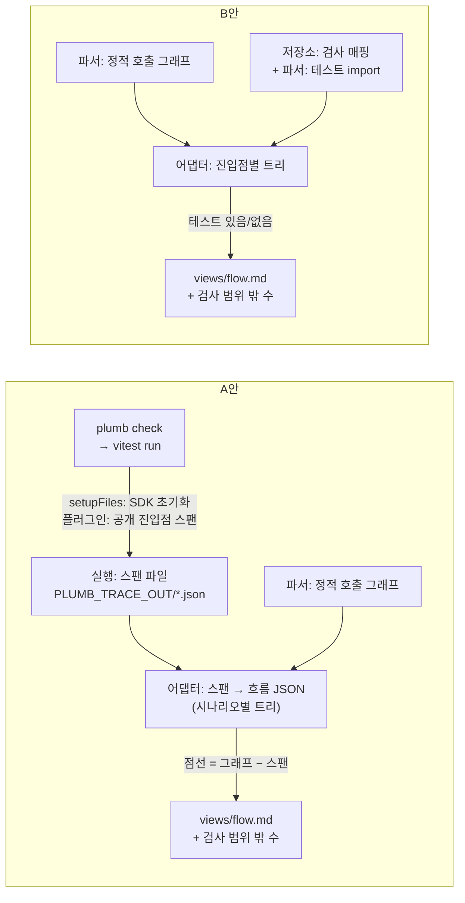

# View: 도메인별 흐름도 (`/views?view=flow`)

이슈 #4의 산출물. `README.md`의 공통 레이아웃과 출처 표기 규칙 2.1, 코드 열람 점프 2.2를 전제로 한다. 기획안 §6.1 "코드를 안 본다는 전제에서 가장 중요한 View"다.

트레이스 수집이 되는지는 M8 spike에서 확인한다(기획안 §4.4, §18, §19). 그래서 두 안을 모두 그린다.

- **A안 (트레이스 기반)**: 테스트 실행 중 OpenTelemetry 스팬으로 실제 호출 순서를 기록. 실선 = 테스트가 실제로 지나간 경로, 점선 = 정적 호출 그래프에는 있지만 실행된 적 없는 분기
- **B안 (정적만)**: 정적 호출 그래프만. 실선·점선 구분이 없고, 대체 표현으로 "테스트 있음/없음"을 `저장소:` 검사 매핑에서 유추한다

어느 안이든 **함수 본문과 제어 흐름은 그리지 않는다**(§16). 호출 단위의 흐름만 그린다. "호출 단위"의 해상도는 4절에서 정한다.

## 1. 답하는 질문

**주요 시나리오가 어떻게 처리되나.** 시나리오(인수 테스트) 하나를 고르면 진입점(`POST /refunds`)부터 호출 체인이 보인다. 어떤 블록이 어떤 순서로 불리고, 어디서 외부 시스템(pg, redis)에 닿고, 어떤 이벤트가 누구에게 전달되는지. 그리고 그 흐름 중 어디까지가 **실제로 실행된 것**인지(A안) 또는 **테스트가 참조하는 것**인지(B안).

부수적으로 답하는 것: 기획안 §7.2 2등급(증거)의 한계 "실행해본 경우만"이 이 View에서 눈에 보인다. 테스트가 안 지나간 흐름 수는 검증 상태 View(#3)의 "검사 범위 밖"에 올라간다.

## 2. 와이어프레임

testbed 가정: 도메인 `payment` · `auth`, 시나리오 `POST /refunds` 정상 환불(7일 이내), 7일 초과 거절, `POST /login` 로그인 성공. 첫 슬라이스 규칙 `pay.refund-window`. 예시 데이터는 이 절 안에만 있다.

### 2.1 A안 — 트레이스 기반

```
┌────────────────────────────────────────────────────────────────────────────────────┐
│ 도메인별 흐름도                     마지막 실행 a1b2c3 · 2분 전 · 트레이스 3건 수집     │
│ 테스트가 안 지나간 흐름 4개 → 검증 상태 View "검사 범위 밖"                            │
├───────────────────┬────────────────────────────────────────────────────────────────┤
│ 시나리오           │ test: 정상 환불 (7일 이내)    test/acceptance/refund.spec.ts:12  │
│                   │ ✔ 통과 · 규칙 pay.refund-window 🟢 · 스팬 9개                    │
│ ▾ payment         │                                                                │
│   ● 정상 환불     │ POST /refunds                     src/app/api/refunds/route.ts:8 │
│     (7일 이내)    │  ━━ auth.verifySession              src/domains/auth/public.ts:21│
│   ○ 7일 초과 거절 │  │   ━━ ⬡ redis GET session:*                                   │
│     (테스트 없음)  │  ━━ payment.refund                src/domains/payment/public.ts:40│
│                   │      ━━ ⬡ pg SELECT payments                                   │
│ ▾ auth            │      ━━ payment.refundWindow.check   src/domains/payment/...:17 │
│   ● 로그인 성공   │      ━━ ⬡ pg UPDATE payments                                   │
│                   │      ━━ emit payment.refunded                                  │
│ 범례              │          ━━ audit.write           src/domains/audit/public.ts:9 │
│ ━━ 실행됨         │          ┈┈ notification.send   src/domains/notification/...:5  │
│    실행: OTel 스팬 │      ┈┈ emit payment.refundRejected                            │
│ ┈┈ 실행 안 됨     │          ┈┈ notification.send                                  │
│    파서: 정적 그래프│                                                                │
│ ⬡ 외부 시스템      │ 이 시나리오에서 실행 안 된 분기 2개 (점선)                         │
│                   │ ⓘ 함수 본문 안의 분기(if)는 그리지 않는다. 호출로 드러난 것만 보인다 │
└───────────────────┴────────────────────────────────────────────────────────────────┘
```

출처: 실선 노드와 순서는 `실행:` OTel 스팬(테스트 실행 중 수집), 점선 노드는 `파서:` 정적 호출 그래프 중 트레이스에 없는 것, 시나리오 목록과 ✔/✘는 `실행:` JUnit XML, 규칙 상태 점은 `저장소:`, `file:line`은 `파서:` 심볼 위치. `⬡ pg SELECT payments`는 `실행:` 스팬 속성(`db.system`, `db.operation`)이다.

같은 화면에서 "7일 초과 거절"을 고르면 (테스트가 없으므로 트레이스가 없다):

```
│ test: (없음) — 7일 초과 거절       정적 그래프에서만 도출된 시나리오                  │
│ 규칙 pay.refund-window 🟢 · 이 분기를 지나는 인수 테스트 없음                         │
│                                                                                     │
│ POST /refunds                                                                       │
│  ┈┈ auth.verifySession                                                              │
│  ┈┈ payment.refund                                                                  │
│      ┈┈ payment.refundWindow.check                                                  │
│      ┈┈ emit payment.refundRejected                                                 │
│          ┈┈ notification.send                                                       │
│                                                                                     │
│ 전부 점선. 검증 상태 View "검사 범위 밖"에 이 흐름이 올라가 있다                        │
```

### 2.2 B안 — 정적 호출 그래프만

```
┌────────────────────────────────────────────────────────────────────────────────────┐
│ 도메인별 흐름도                  정적 그래프 a1b2c3 · 2분 전   ⓘ 트레이스 없음 (B안)   │
│ 테스트가 참조하지 않는 진입점 2개 → 검증 상태 View "검사 범위 밖"                       │
├───────────────────┬────────────────────────────────────────────────────────────────┤
│ 진입점             │ POST /refunds                     src/app/api/refunds/route.ts:8 │
│                   │ 테스트 있음: refund.spec.ts:12 (규칙 pay.refund-window 🟢)       │
│ ▾ payment         │                                                                │
│   POST /payments  │ POST /refunds                                      테스트       │
│     테스트 없음   │  ── auth.verifySession              auth/public.ts:21   참조됨   │
│   POST /refunds   │  ── payment.refund                payment/public.ts:40  참조됨   │
│     테스트 있음   │      ── payment.refundWindow.check     ...:17          (내부)   │
│                   │      ── ⬡ pg (prisma client import)                    (정적)   │
│ ▾ auth            │      ── emit payment.refunded  ⚠ 핸들러 연결 불명              │
│   POST /login     │      ── emit payment.refundRejected  ⚠ 핸들러 연결 불명        │
│     테스트 있음   │                                                                │
│                   │ 정적 그래프에서 안 보이는 것 — 이벤트 핸들러 · 미들웨어 순서 · DI 구현│
│ 범례              │ 호출 순서는 import 순서가 아니다. 순서는 표시하지 않는다            │
│ ── 정적 엣지       │                                                                │
│ 참조됨 = 테스트 파일이│ "참조됨"은 테스트 파일이 그 공개 진입점을 import·호출한다는 뜻이다. │
│   import·호출      │ 실행됐다는 뜻이 아니다                                          │
└───────────────────┴────────────────────────────────────────────────────────────────┘
```

출처: 모든 노드·엣지는 `파서:` 정적 호출 그래프, 진입점 ↔ 테스트 연결은 `저장소:` 검사 매핑(규칙 → 테스트 파일 → 진입점) + `파서:` 테스트 파일의 import 그래프, "테스트 있음/없음"은 그 둘에서 계산, 규칙 상태 점은 `저장소:`.

B안에는 "7일 초과 거절" 시나리오가 **없다.** 정적 그래프는 분기를 모르므로 시나리오 단위가 아니라 진입점 단위로 보여준다. 이것이 B안에서 잃는 가장 큰 정보다 (2.3).

### 2.3 두 안의 비교

| 관점 | A안 (트레이스 + 정적) | B안 (정적만) |
|---|---|---|
| 단위 | 시나리오(인수 테스트) 하나 = 흐름 하나 | 진입점 하나 = 흐름 하나. 시나리오 구분 없음 |
| 그릴 수 있는 것 | 실제 호출 순서, 실행된 노드와 안 된 노드, 외부 시스템에 실제로 보낸 연산, 이벤트 핸들러·DI 구현·미들웨어 체인 | import·호출 식으로 드러난 정적 엣지, 외부 클라이언트 import 사실 |
| 실선·점선 | 있음. 검증 상태가 흐름도에 저절로 겹친다 (§6.1) | 없음. 대체 표현: 진입점 단위 "테스트 있음/없음", 노드 단위 "참조됨" |
| 잃는 정보 (B안으로 갈 때) | — | ① 호출 **순서** ② 분기별 실행 여부 → "7일 초과 거절" 같은 시나리오가 사라진다 ③ `emit` → 핸들러 연결 (토픽 문자열 매칭은 정적으로 불확실) ④ DI로 주입된 구현 (인터페이스까지만 보인다) ⑤ 미들웨어 체인 순서 (`middleware.ts`, 핸들러 래퍼) ⑥ 외부 시스템에 **실제로** 보낸 연산 (import 사실만 남는다) ⑦ 동적 import·런타임 등록 ⑧ "참조됨 ≠ 실행됨": 테스트가 import만 하고 mock으로 바꿔치면 B안은 속는다 |
| 검증 상태와의 겹침 | 노드 단위. 점선 노드 수 = 검사 범위 밖 | 진입점 단위. 테스트 없는 진입점 수 = 검사 범위 밖. 해상도가 거칠다 |
| 어댑터가 해야 할 일 | Vitest `setupFiles`에 SDK 초기화 · 블록 공개 진입점을 스팬으로 감싸는 변환 · 외부 시스템 계측 등록 · 스팬 → 흐름 JSON 변환 · 정적 그래프와 대조(점선 계산) | 심볼 수준 호출 그래프 생성(TS 컴파일러 API 또는 dependency-cruiser 심볼 수준) · Next.js 파일 규약 → 진입점 매핑 · 테스트 import 그래프 · 검사 매핑과 조인 |
| 전제 조건 | 4.1절 여섯 가지. spike에서 확인 | TS 소스가 파싱되면 된다. 즉시 가능 |
| 비용 | 테스트 실행 시간 증가(동기 export), 계측 코드가 testbed에 들어감, OTel 패키지 의존 추가, 언어마다 다시 만들어야 함(§18) | 그래프 생성 비용만. 언어 독립성도 낮음(TS 전용 파서) |
| 틀릴 수 있는 방향 | 계측이 안 붙은 호출이 점선으로 보인다 (실행됐는데 안 됐다고). 보수적 오류 | 정적으로 못 본 엣지가 아예 없다 (연결이 있는데 없다고). 낙관적 오류 — 더 위험하다 |
| 어느 안이든 공통 | "테스트가 안 지나간 흐름 수"를 검증 상태 View의 검사 범위 밖에 올린다. `file:line` 점프는 `파서:` 심볼 위치에서 온다 | 같음 |

B안의 틀림이 더 위험한 이유: 흐름도는 "코드를 안 보고 믿는" 근거다. 없는 연결을 있다고 하는 것보다 있는 연결을 없다고 하는 것이 사람을 더 크게 속인다. 그래서 B안 화면은 "정적 그래프에서 안 보이는 것" 안내를 항상 띄운다.

## 3. 항목 표

| 항목 | 출처 | 생성 방식 | 도입 마일스톤 | 비고 |
|---|---|---|---|---|
| 마지막 실행 커밋 · 시각 | `저장소:` 검사 결과 이력 | `plumb check`가 남긴 마지막 기록 | M5 | 상단 바의 "마지막 검사"와 같은 값 |
| 수집된 트레이스 수 (A안) | `실행:` 트레이스 파일 개수 | 테스트 실행 중 exporter가 쓴 파일을 센다 | M8 wave 1 | 0이면 5절 |
| 테스트가 안 지나간 흐름 수 | `실행:` 트레이스 − `파서:` 정적 그래프 (A안) / `파서:` 테스트 참조 없는 진입점 (B안) | 계산 결과를 검사 결과에 기록해 검증 상태 View(#3)가 읽는다 | M8 wave 1 | 기획안 §14 "검사 범위 밖 크기" |
| 시나리오 목록 (A안) | `실행:` JUnit XML 테스트 이름 + `저장소:` 검사 매핑(규칙 → 테스트) | 인수 테스트 하나 = 시나리오 하나. 도메인은 테스트가 연결된 규칙의 블록 | M5 (JUnit) · M8 wave 1 | `test/acceptance/**`만. 단위 테스트는 시나리오가 아니다 |
| 정적 그래프에서만 도출된 시나리오 (A안 점선 전용) | `파서:` 정적 호출 그래프 중 어떤 트레이스에도 없는 분기 | 트레이스가 지나지 않은 `emit`·호출 노드를 진입점별로 묶는다 | M8 wave 1 | 이름은 노드 식별자로만 짓는다 ("emit payment.refundRejected 경로"). 자유 문장 금지. 와이어프레임의 "7일 초과 거절"은 설명용 이름 |
| 진입점 목록 (B안) | `파서:` Next.js 파일 규약 (`src/app/api/**/route.ts`의 export `POST` 등) | 라우트 파일 경로 → 메서드 + 경로 | M8 wave 1 | OpenAPI와 어긋나면 데이터 모델/계약 View(#3)의 문제로 넘긴다 |
| 시나리오 결과 ✔/✘ | `실행:` JUnit XML | testcase 통과/실패 | M5 | 실패한 시나리오의 트레이스도 그린다 (실패 직전까지의 흐름) |
| 연결 규칙과 상태 점 | `저장소:` 검사 매핑 + 규칙 상태 | 시나리오가 검사하는 규칙 | M5 | 규칙 없는 테스트는 "(규칙 없음)" |
| 실선 노드 · 순서 · 중첩 (A안) | `실행:` OTel 스팬 (이름 · parent · 시작 시각) | 스팬 트리를 그대로 그린다. 이름은 `블록.공개함수` | M8 wave 1 | 소요 시간은 그리지 않는다 (성능 View가 아니다) |
| 점선 노드 (A안) | `파서:` 정적 호출 그래프 | 실선 노드에서 정적으로 닿는 노드 중 스팬이 없는 것 | M8 wave 1 | 정적 그래프에 없고 스팬에만 있는 노드(핸들러·DI)는 실선으로만 그린다 |
| 정적 엣지 (B안) | `파서:` 심볼 수준 호출 그래프 (TS 컴파일러 API 또는 dependency-cruiser 심볼 수준) | 진입점에서 도달 가능한 호출 식을 따라간다 | M8 wave 1 | 순서 없음. 깊이 상한은 6절 |
| 외부 시스템 노드 ⬡ (A안) | `실행:` 스팬 속성 `db.system` · `net.peer.name` · 메시징 속성 | 외부 시스템 계측 라이브러리가 만든 스팬 | M8 wave 1 | 연산 종류(SELECT/UPDATE)까지. SQL 본문은 그리지 않는다 |
| 외부 시스템 노드 ⬡ (B안) | `파서:` 외부 클라이언트 import (외부 의존성 View #3의 분류) | 노드 파일이 외부 클라이언트를 import하면 표시 | M8 wave 1 | "호출 가능성"이지 "호출함"이 아니다. 범례에 적는다 |
| 이벤트 노드 `emit <topic>` · 핸들러 | `실행:` 어댑터 계측 스팬 (A안) / `파서:` emit 호출 식 (B안, 핸들러 연결 불명) | A안: emit과 handle을 스팬으로 감싼다. B안: emit만 보인다 | M8 wave 1 | testbed의 이벤트 버스 방식(M2)에 따른다 |
| `file:line` | `파서:` 심볼 위치 | 스팬 이름(`블록.함수`)을 정적 심볼 표로 역조회 | M8 wave 1 | README 2.2 점프. 스팬에 `code.filepath`·`code.lineno` 속성을 실어도 되지만 정본은 파서 |
| 진입점의 "테스트 있음/없음" (B안) | `저장소:` 검사 매핑 + `파서:` 테스트 파일 import 그래프 | 테스트 파일 → import된 공개 진입점 → 그 진입점을 부르는 라우트 | M8 wave 1 | "참조됨"은 실행됨이 아니다. 화면에 명시 |
| 노드의 "참조됨 / 내부 / 정적" (B안) | `파서:` 테스트 import 그래프 | 참조됨 = 테스트가 직접 import. 내부 = 공개 진입점 뒤의 노드. 정적 = 외부 클라이언트 import | M8 wave 1 | |
| "트레이스 없음 (B안)" 안내 | `실행:` 트레이스 파일 없음 또는 설정 `flow.mode = static` | spike 결과에 따라 어댑터가 모드를 정한다 | M8 wave 1 | 어느 모드인지 항상 머리글에 표시 |
| 도메인 묶음 (좌측) | `파서:` 블록 그래프 (L1) | 시나리오/진입점을 블록으로 묶는다 | M8 | README 2 블록 트리와 같은 데이터 |
| 시나리오·진입점 선택 | `사용자 입력:` | 선택 상태는 URL(`?view=flow&scenario=...`) | M8 wave 2 | 블록 트리 클릭은 좌측 목록을 거른다 |
| 코드 열람 점프 | `사용자 입력:` 이유 종류 → `POST /api/open` | README 2.2 | M8 wave 2 | |

## 4. 동작

### 4.0 호출 단위의 해상도

"함수 본문·제어 흐름은 그리지 않는다"를 지키면서 그릴 수 있는 호출 단위는 다음 셋이다. 두 안 모두 같은 해상도를 쓴다.

1. 블록의 **공개 진입점** (`src/domains/<block>/public.ts`의 export, 기획안 §4.4 블록 구조)
2. **외부 시스템** 호출 (pg · redis · 큐 · 외부 HTTP)
3. **이벤트** emit과 핸들러

블록 안의 내부 함수(`refundWindow.check`)는 공개 진입점이 직접 부르는 한 단계까지만 그린다. 그 아래는 그리지 않는다. 이유: 더 깊이 들어가면 함수 본문을 그리는 것과 같아지고, 에이전트가 내부 구조를 바꿀 때마다 흐름도가 흔들린다. 공개 진입점 단위면 블록 경계(규칙이 걸리는 곳)와 해상도가 일치한다.

따라서 "7일 초과 거절"처럼 함수 **안의** `if` 한 줄로 끝나는 분기는 두 안 모두에서 보이지 않는다. 분기가 호출(`emit payment.refundRejected`, `notification.send`)로 드러날 때만 노드가 생긴다. 호출로 드러나지 않는 분기는 시나리오 결과(HTTP 상태 코드, `실행:` 루트 스팬의 `http.status_code`)로만 구분된다. 6절 열린 질문.

### 4.1 A안의 전제 조건과 수집 경로

M8 spike에서 확인할 것. 아래 사실 중 (a)~(c)는 공식 문서에서 확인했고, (d)~(f)는 spike에서 실험으로 확정한다.

| # | 전제 | 근거 · 판단 |
|---|---|---|
| (a) | Next.js `instrumentation.ts`의 `register()`는 **Next.js 서버 인스턴스가 시작될 때 한 번** 호출된다 | Next.js 문서: "This function will be called once when a new Next.js server instance is initiated". Vitest는 Next 서버를 띄우지 않으므로 **Vitest 실행 중에는 `register()`가 호출되지 않는다.** 기획안 §4.4의 우려가 맞다 |
| (b) | 따라서 테스트 실행 중 SDK 초기화는 Vitest `setupFiles`에서 한다 | Vitest 문서: setupFiles는 "run before each test file in the same process", globalSetup은 "runs once in the main thread before any test worker is created". SDK는 워커 프로세스 안에 있어야 하므로 `setupFiles`. OTel 문서 "Before any other module in your application is loaded, you must initialize the SDK"는 setupFiles가 테스트 파일 import 전에 돌므로 만족. `isolate: false`면 모듈 캐시 때문에 `globalThis` 가드 필요 |
| (c) | 도메인 함수에는 **자동 스팬이 없다** | Next.js 기본 스팬은 `[http.method] [next.route]`, `executing api route (app) [next.route]` 등 라우트 수준뿐. `payment.refund`는 어댑터가 감싸야 한다. 방법: Vitest(vite) 플러그인으로 `src/domains/*/public.ts`의 export를 `tracer.startActiveSpan('<block>.<name>', …)`로 감싸는 변환. 소스는 건드리지 않는다. 이것이 4.0의 해상도를 그대로 구현한다 |
| (d) | 외부 시스템 스팬은 계측 라이브러리(`@prisma/instrumentation`, `@opentelemetry/instrumentation-ioredis` 등)로 | 이들은 모듈 로드를 가로채는 방식(require-in-the-middle)이다. Vitest는 `node_modules`를 외부화해 Node가 직접 로드하므로 CJS 패키지엔 붙을 가능성이 높고, ESM 전용 패키지엔 loader hook이 필요하다. **spike 항목 1** |
| (e) | 수집기는 외부 collector가 아니라 **파일**로 | `SimpleSpanProcessor` + 파일 exporter(`InMemorySpanExporter`를 테스트 파일 끝에 flush). 쓰는 곳은 `plumb check`가 환경변수로 넘긴 임시 디렉토리(`PLUMB_TRACE_OUT`). 워커마다 파일 하나(`VITEST_POOL_ID`). `plumb check`가 읽어 보호 저장소에 옮긴다. 에이전트 샌드박스는 `~/.plumb/**`를 못 읽으므로 임시 디렉토리는 레포 밖 다른 곳. **spike 항목 2**: BatchSpanProcessor 대신 Simple을 써도 테스트 시간이 견딜 만한가 |
| (f) | 스팬 ↔ 테스트 매핑 | `setupFiles`의 `beforeEach`에서 테스트마다 루트 스팬을 열고 `test.name`·`test.file` 속성을 단다. 테스트 안의 호출은 AsyncLocalStorage 컨텍스트로 그 루트 아래에 붙는다. **spike 항목 3**: `pool: 'forks'`와 `'threads'` 모두에서 컨텍스트가 이어지는가, 병렬 테스트(`concurrent`)에서 섞이지 않는가 |
| (g) | 인수 테스트가 HTTP를 거치는가 | 테스트가 `payment.refund()`를 직접 부르면 `POST /refunds → auth.verifySession` 구간은 스팬이 없고 정적 그래프에서만 온다(점선). 테스트가 Route Handler 함수(`POST(request)`)를 직접 부르거나 서버를 띄워 fetch하면 실선. **M2 testbed의 인수 테스트 작성 방식**이 이 View의 실선 범위를 정한다 |

(a)~(c)만으로도 결론 하나는 난다: **A안은 `instrumentation.ts`에 기대지 않는다.** `instrumentation.ts`는 `next dev`/`next start` 때 쓰는 것이고, 흐름도의 트레이스는 Vitest `setupFiles` + 어댑터의 변환 플러그인에서 온다. 둘이 같은 SDK 설정 모듈을 공유하면 된다.

### 4.2 생성 흐름



- 두 안 모두 결과는 `views/flow.md`(Markdown + 흐름 JSON)이고 `GET /api/views/flow`가 읽는다 (README 3.3). 시나리오 선택은 쿼리 파라미터.
- 흐름도는 **에이전트가 돌린 테스트가 아니라 `plumb check`가 돌린 테스트**에서 온다. 에이전트의 테스트 실행 결과는 증거가 아니다 (기획안 §8).
- 정적 그래프는 두 안의 공통 재료다. B안으로 시작해도 A안으로 갈 때 버릴 것이 없다.

### 4.3 화면 동작

- 시나리오(A안) 또는 진입점(B안)을 고르면 본문이 그 트리로 바뀐다. 기본 선택은 목록의 첫 항목.
- 노드를 누르면 `file:line`로 점프한다(README 2.2, 이유 종류 선택). 외부 시스템 노드는 점프 대상이 없고, 외부 의존성 View(#3)의 해당 항목으로 간다.
- 점선 노드(A안)를 누르면 "이 분기를 지나는 인수 테스트 없음 · 검사 범위 밖 #n" 과 검증 상태 View 링크.
- 블록 트리에서 블록을 누르면 좌측 목록이 그 블록의 시나리오/진입점으로 걸러진다. 트리 안의 다른 블록 노드는 흐려지되 숨기지 않는다 (흐름은 블록을 넘는다).
- `emit` 노드 아래의 핸들러는 접을 수 있다. 기본은 펼침.
- 상단 "테스트가 안 지나간 흐름 n개"를 누르면 검증 상태 View의 검사 범위 밖 절로 간다.
- 그리지 않는 것: 소요 시간, 호출 횟수, 인자·반환값, SQL 본문, 함수 안의 분기. 스팬에 있어도 안 그린다.

## 5. 비어 있을 때

목 데이터로 채우지 않는다.

| 상태 | 판정 | 화면 |
|---|---|---|
| 정적 그래프가 없다 | `plumb views`가 한 번도 안 돌았다 | "아직 생성되지 않음. `plumb views flow`". 좌측 목록도 비운다 |
| 정적 그래프는 있는데 진입점 0개 | 파서가 `route.ts`를 못 찾음 | "진입점 없음 — `src/app/api/**/route.ts`에서 export된 메서드가 없다". 설정(`plumb.config.json`)의 진입점 글롭을 안내 |
| A안인데 트레이스 파일이 0개 | `PLUMB_TRACE_OUT` 비어 있음 | 머리글에 "트레이스 없음 — 이번 실행에서 스팬이 수집되지 않았다 (setupFiles 미설정 또는 exporter 실패)". 본문은 **B안 표현으로 자동 전환**하고 모드를 "정적(대체)"로 표시한다. 조용히 A안인 척하지 않는다 |
| 트레이스는 있는데 특정 시나리오에 스팬 0개 | 테스트가 통과했지만 계측된 호출이 없음 | 그 시나리오를 전부 점선으로 그리고 "스팬 0개 — 공개 진입점을 거치지 않는 테스트"로 표시. 이것은 테스트가 블록 경계를 우회한다는 신호이므로 검증 상태 View에도 올린다 |
| 인수 테스트가 0개 | JUnit XML에 `test/acceptance/**` testcase 없음 | A안: 시나리오 목록 "인수 테스트 없음". B안 표현으로 전부 그리고 모든 진입점이 "테스트 없음" |
| 테스트가 실패했다 | JUnit XML failure | 시나리오에 ✘. 실패 직전까지의 스팬은 실선, 그 뒤는 점선. "실패 지점" 표시는 마지막 스팬 |
| 정적 그래프 파서 실패 | TS 파싱 오류 | "정적 그래프 생성 실패: <오류 한 줄>". A안이면 실선만 그리고 점선 없음을 머리글에 표시 |

## 6. 열린 질문

#5 타입 설계로 넘길 것:

1. `FlowNode` 타입: `id`(`<block>.<symbol>` 또는 `ext:<system>:<op>` 또는 `event:<topic>`), `kind: 'entry'|'public'|'internal'|'external'|'emit'|'handler'`, `file?`, `line?`, `children[]`, `evidence: 'span'|'static'|'both'`(A안) / `testRef: 'referenced'|'internal'|'static'`(B안). 두 안을 하나의 타입으로 두고 `mode: 'trace'|'static'`로 구분하는 안을 제안한다. 5절의 "자동 전환"이 그래야 자연스럽다.
2. `FlowScenario` 타입: `testId`(JUnit의 classname+name), `file`, `line`, `ruleIds[]`, `result`, `root: FlowNode`, `uncoveredCount`. B안의 진입점 단위와 A안의 시나리오 단위를 같은 타입으로 둘지.
3. 검증 상태 View(#3)에 넘기는 "검사 범위 밖" 항목의 타입: `{ kind: 'uncovered-flow', scenarioOrEntry, nodeIds[], mode }`. #3과 같은 `OutOfScope` 타입을 써야 한다.
4. 정적 호출 그래프의 깊이 상한과 "내부 한 단계" 규칙(4.0)을 타입에 둘지 설정에 둘지.

M8 spike로 넘길 것 (A안 가부 판정):

5. **spike 항목 1** — Vitest 워커 안에서 `@prisma/instrumentation`·ioredis 계측이 실제로 스팬을 내는가. 안 되면 외부 시스템 노드는 B안 방식(import 사실)으로 두고 나머지는 A안으로 가는 혼합도 가능하다.
6. **spike 항목 2** — `SimpleSpanProcessor` + 파일 exporter의 테스트 시간 영향. testbed 인수 테스트 수가 적어 문제없을 가능성이 높지만 측정한다.
7. **spike 항목 3** — `pool: 'forks'`/`'threads'`, `test.concurrent`에서 테스트별 루트 스팬이 섞이지 않는가.
8. 공개 진입점을 감싸는 vite 플러그인이 `tsc --noEmit`·depcruise와 충돌하지 않는가 (테스트 때만 변환하므로 안 할 것으로 본다).
9. 인수 테스트가 Route Handler를 거치게 할지(M2 testbed 결정). 거치지 않으면 `POST /refunds` 노드는 항상 점선이고 흐름도가 "진입점부터"를 못 지킨다.
10. 함수 안의 `if`로만 갈리는 분기(4.0)를 어떻게 드러낼지. 후보: (i) 시나리오 결과(상태 코드)만 보여주고 분기는 포기 (ii) testbed 코딩 규약으로 분기를 호출(`emit`, 정책 객체)로 드러내게 한다 (iii) Vitest 커버리지(`실행:` v8 함수·분기 커버리지)를 보조 재료로 쓴다 — 순서는 없지만 분기 실행 여부는 안다. (iii)은 B안에 붙여도 되는 중간안이라 spike에서 같이 잰다.
11. B안의 정적 호출 그래프 도구: dependency-cruiser는 모듈(파일) 수준이라 심볼 수준이 안 나온다. TS 컴파일러 API로 직접 쓰거나 다른 도구를 고른다. 아키텍처 View(#3)는 모듈 수준으로 충분하지만 이 View는 심볼 수준이 필요하다.
12. 언어 확장(§18): A안의 setupFiles·플러그인은 전부 TS/Vitest 전용이다. 다른 언어 어댑터는 그 언어의 테스트 러너 훅으로 같은 스팬 파일 형식을 내면 된다. 스팬 파일 형식을 어댑터 인터페이스(M1 #8)에 넣을지.
